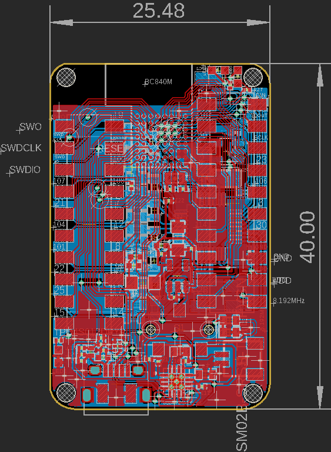

# nRF52 Biosensing Boards

This contains our working prototypes for using nRF52 microcontrollers (ARM + BLE5) with low cost sensors. [Doc](https://docs.google.com/document/d/1gOrWiBDynYziCYDMF4r1Rw85PXo9JbuBrYJEEkW2U-c/edit?usp=sharing). 

Features Zephyr RTOS test firmware, which is hardware-agnostic. BC840M config is in the Firmware folder incl ADS131 drivers

The current prototypes here are breakout boards, they are pin compatible with several different modules while it's easy to spin up new designs with similar products. Next versions will be further miniaturized.

Supports an ADS131M08 (8 channel sigma delta converter), and additionally detects for MPU6050 accelerometer, MAX30102 pulse oximeter, BME280 environmental sensor, and an additional 8 channel ADS131M08. 

License: AGPL v3.0

Joshua Brewster, Jacob Tinkhauser, Bojan Jovanovich

Developed for creating open source [Brains@Play](https://brainsatplay.com) and [MyAlyce](https://github.com/myalyce/myalyce) wearables for neurofeedback and treatment recovery monitoring.

Related:
[Firmware for BT832A prototype](https://github.com/joshbrew/BT832_Zephyr)