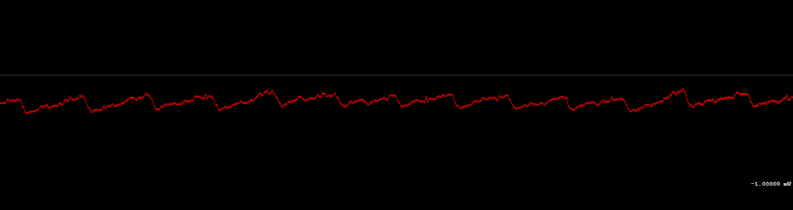

# nRF52 Biosensing Boards

This contains our working prototypes for using nRF52 microcontrollers (ARM + BLE5) with low cost sensors. [Doc](https://docs.google.com/document/d/1gOrWiBDynYziCYDMF4r1Rw85PXo9JbuBrYJEEkW2U-c/edit?usp=sharing). 

Features Zephyr RTOS test firmware, which is hardware-agnostic. BC840M config is in the Firmware folder incl ADS131 drivers.

The current prototypes here are working breakout boards. They are pin compatible with several different modules while it's easy to spin up new designs with similar products. Next versions will be further miniaturized.

Supports an ADS131M08 (8 channel sigma delta converter), and additionally detects for MPU6050 accelerometer, MAX30102 pulse oximeter, BME280 environmental sensor, and an additional 8 channel ADS131M08 for up to 16 raw data channels, each individually configurable. 

License: AGPL v3.0 copyleft (public domain)

Version 3 (BC840M R2 && BC40M incoming designs and PDF) by Joshua Brewster and Bojan Jovanovich. Firmware by Bojan Jovanovich, drawings and frontend software by Josh Brewster. 

Versions 1 (BT832A) and 2 (BC840M R1) by Joshua Brewster, Jacob Tinkhauser, Bojan Jovanovich.Firmware by Bojan Jovanovich, drawings and frontend software by Josh Brewster. Testing and early design phase included Jacob Tinkhauser. 

Developed for creating open source [Brains@Play](https://brainsatplay.com) and [MyAlyce (WIP)](https://github.com/myalyce/myalyce) wearables for neurofeedback and treatment recovery monitoring.

Related:
- [BLE & USB Web Debugger with supported drivers](https://github.com/joshbrew/device_debugger)
- [Firmware for BT832A prototype](https://github.com/joshbrew/BT832_Zephyr)

Below results with the ADS131M08 doing quick tests - will upload real tests with recordings now that we fixed some noise issues.

- EEG alpha waves (spikes are blinks through a digital bandpass filter)

- ECG with additional digital 50Hz lowpass

- Raw EOG

- Raw PPG wave
